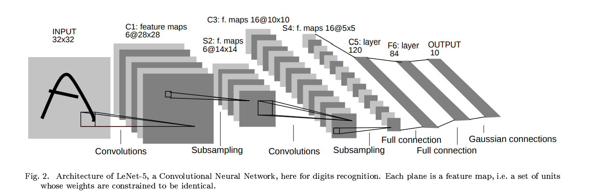
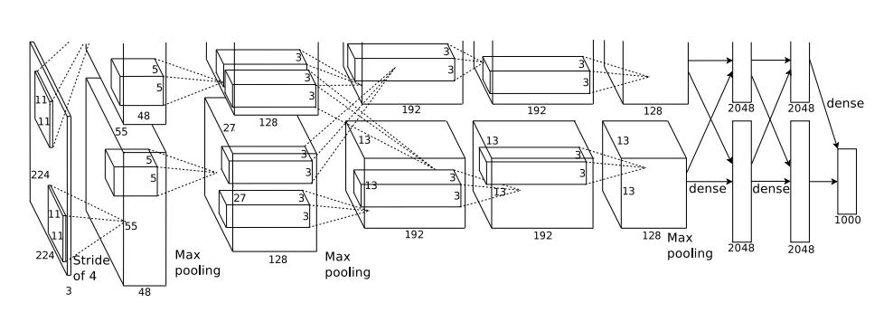

# German Traffic Sign Recognition Benchmark (GTSRB)
### DS-420 Luther College
Machine Learning with Convolutional Neural Networks (CNN) in the AlexNet and LeNet Architecutre

## Motivation
In this project, we will be using the popular image classification deep learning dataset German Traffic Signal Recognition Benchmark (GTRSB) dataset, comparing two of the earliest convolutional neural network architectures (LeNet, AlexNet) comparing strengths, process and implementation. We will be classifying more than 50,000 images into 43 class-fields using a convnet.

## Data
In this project, we will be using the popular image classification deep learning dataset German Traffic Signal Recognition Benchmark (GTRSB) dataset, comparing two of the earliest convolutional neural network architectures (LeNet, AlexNet) comparing strengths, process and implementation. We will be classifying more than 50,000 images into 43 class-fields using a convnet.

*Overview*
* Training Data: 39210 rows
* Test Data: 12631 rows Meta Data: 44 rows Total Data​ 51,885 ​rows

*Structure*
* The training set archive is structured as follows:
* One directory per class
* Each directory contains one CSV file with annotations ​("GT-<ClassID>.csv")​ and the training images
* Training images are grouped by tracks
* Each track contains 30 images of one single physical traffic sign

*Image format*
* The images contain one traffic sign each
* Images contain a border of 10 % around the actual traffic sign (at least 5 pixels) to allow for edge-based approaches
* Images are stored in PPM format (Portable Pixmap, P6)
* Image sizes vary between 15x15 to 250x250 pixels
* Images are not necessarily squared
* The actual traffic sign is not necessarily centered within the image.This is true for images that were close to the image border in the full camera image

More information can be found in the preprocessing notebook.

## LeNet

Accuracy
* 95.8%     -    Training
* 91.4%     -    Validation
* 89.3      -    Testing

[Relevant LeNet Notebook](./LeNet.ipynb)

## AlexNet

Accuracy
* 100.0%    -    Training
* 96.6%     -    Validation
* 95.1      -    Testing

[Relevant AlexNet Notebook](./AlexNet.ipynb)

